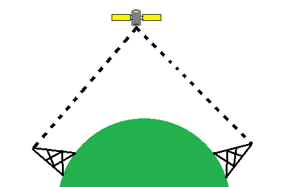
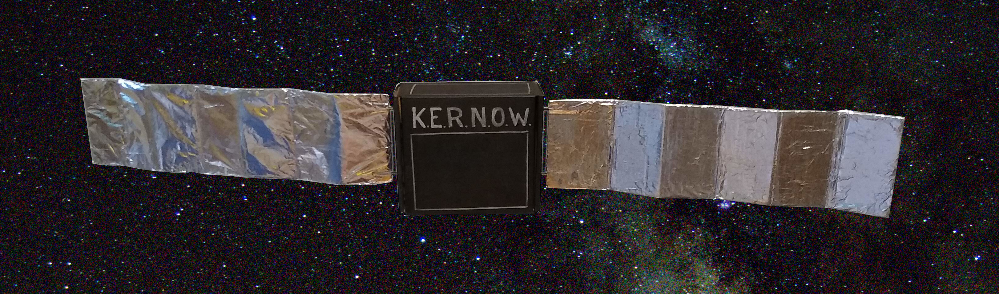
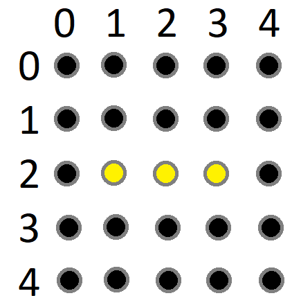

# Microbit-Satellite-Morse-Code-Communication-System
Build a Microbit satellite that relays messages on from a transmitting Microbit to a distant receiving Microbit.

This exercise utilises the Microbit radio, loops, Morse Coding, lists, a dictionary and the REPL of the Mu editor.

# Microbit Satellite Communications

The BBC Microbit is a handy little programmable board that even has the capability of sending information from one 
board to another with radio. A possible problem that is encountered in the real world is how to extend the range of the 
radio beyond line of sight. Satellites in space are used to get around this problem by having a radio transmission on the 
ground being sent up to the satellite and then the transmission being passed on down to the receiving station over the 
horizon from the originating station.



In this worksheet you will be using the radio feature of the Microbit to send messages from one to another via a third 
as your satellite.

### Items Needed
- 3 Microbit
- 3 battery packs
- 1 programming lead
- One Satellite to put a Microbit in



## Starting with some Basics

Coding for the Microbits will be with Micropython on the Mu editor. The first line is below. This imports into the program 
the basics needed for the code to work on the Microbit.
```
from microbit import *

For the next line print a message on the Microbit using the LED.

display.scroll(“Hello Planet Earth”)
```

These two lines of code can now be flashed onto the Microbit memory and the message should show.
Connect the Microbit with the cable. A pop up will appear but just cancel this. Now click the Flash button on the Mu editor 
and the code will be copied across and the message will show. 

## A Little More Code

Now upgrade the code so that the message will only show when a button is pressed. The code below is the complete code. Do not 
add the code below to what you already have. This code will constantly check to see if the A button is pressed and then scroll 
the message when it is. Upload this to the Microbit and try it.
```
from microbit import *

while True:
	  if button_a.is_pressed():
    display.scroll(“Hello planet Earth”)
```

The while True: line sets up a forever loop. It constantly reads any lines of code after it again and again. The third line 
displaying the text only runs if the line above senses that the A button has been pressed.

## Starting the Radio

The next stage is to complete the code for this first Microbit so that when the button is pressed a message is sent over the 
radio to be picked up by another. The code below is very similar to the previous. This time though the radio is imported and 
turned on. Then when the button is pressed the message is sent and at the same time a letter “m”, for message, is briefly, for 
500 milliseconds, displayed just to confirm the message has been sent.
```
from microbit import *
import radio

radio.on()

while True:
    if button_a.is_pressed():
        radio.send("Hello Planet Earth")
        display.show("m")
        sleep(500)
        display.clear()
```

## Receiving the Message

The message has been sent but there is nowhere to receive it.

Remove the first Microbit and replace it with the second Microbit. The code needed is below. The first part is much the same 
as before. Open a new tab in the Mu editor and use this for the code below. Copy and paste the code needed from the first tab 
to save time.
This time the loop is listening for a signal to come in instead of the button being pressed. A signal received is saved as the 
variable called message. If there was a message then only then is it displayed. Upload this to the Microbit.
```
from microbit import *
import radio

radio.on()

while True:
    message = radio.receive()
    if message:
        display.scroll(message)
```

Connect a battery pack to the first message sending Microbit and press the A button. The message will appear on the other.

### Hack the Code
For an extra exercise try adding a different message to be sent. Then add some extra code to send two different messages 
when either the A or B button is pressed. For this you will need to add a new “if” button B is pressed line of code. It needs
to be slightly different in that it starts with “elif”, which is short for “else if”, instead of the “if” at the beginning. 
If you get stuck, ask for help.

## Sending a Message a Long Way
So how far can the message be sent from one Microbit to the other? Power both Microbits with a battery pack see how far apart 
they can be before the message can not be seen on the receiving one. It should be somewhere around 10 metres.

## Build a Satellite
Extending the range will require your satellite to receive the message and resend it on further.

Plug in the third Microbit. Open another tab for coding and type in the code below.
```
from microbit import *
import radio

radio.on()

while True:
    message = radio.receive()
    if message:
        radio.send(message)
        display.show(“m”)
        sleep(2000)
        display.clear()
```

You can probably work out the code by now. It is a bit of both of the other parts. The Microbit Satellite will listen for a 
message and then send the message out again. It doesn’t matter what the message is, it will just resend anything it hears.

Upload the code, connect another battery pack place it in your satellite and now see how far it is possible to send your messages.

## Morse Code

The original code to send messages by telegraph was invented in the 1830’s. The International Version was finalised in 1951 and 
is shown here.


To send a letter the appropriate dots and dashes were sent by holding down a key either quickly or slightly slower. The receiver
of the message would compare the dots and dashes heard to the key and write the message down letter by letter.

If the A button on a Microbit is set up as a dot and the B as a dash any message can be sent via your satellite.

## Morse Code Sender, the Dots and Dashes

The code for the message sending Microbit has some familiar parts and some new. Plug your first Microbit back in and in the 
first tab make some changes.

Start with getting a dot or a dash to appear on the LED when the buttons are pressed.
```
from microbit import *

while True:
    if button_a.is_pressed():
        display.set_pixel(2,2,9)
        sleep(200)
        display.clear()
```

The code shows just a single pixel in the middle of the screen of LED, the dot. The (2,2,9) are the coordinates of the LED 
to light up at maximum intensity of 9. Computers count from zero instead of one so the third LED along is number two not three. 
The top left pixel is at zero, zero (0,0). One pixel to the right is (1, 0) then (2,0). One down the screen is (2,1) and 
then (2,2). See the image on the next page.



The dash could be made by using three display.set_pixel commands for three separate dots in a row. Or the Microbit has a way 
of designing any image you like.
```
from microbit import *

dash_image = Image("00000:"
             	   "00000:"
                   "09990:"
                   "00000:"
                   "00000")

while True:
    if button_a.is_pressed():
        display.set_pixel(2,2,9)
        sleep(200)
        display.clear()
    elif button_b.is_pressed():
        display.show(dash_image)
        sleep(200)
        display.clear()
```

In the dash_image = part of the code above the image is created using a series of five numbers in five rows representing each LED. 
The LED can be at varying intensities of illumination from zero being off to 9 being brightest. So as you can see there are just 
three 9s in the middle, the dash.

In the code inside the loop the image is shown just by calling the list of numbers. Now when the button B is pressed the dash 
should show.

## Using a List to Store the Message

To get the code to send a sequence of dots and dashes representing the letters will require the set of dots and dashes for each 
letter to be sent as one. To do this each element will be stored one at a time until the letter is finished and then the whole 
letter’s code is sent.

To demonstrate how a list works will require a slight tweek to the Mu editor. Select the REPL button which will open a live coding 
shell at the bottom. Here you can code live without needing to upload and wait all the time. It is also a way to receive feedback 
from the Microbit whilst it is running.

In the live shell REPL area after the >>> type the following and press Enter.
```
>>>dots_and_dashes = []
```
This declares a list called “dots_and_dashes” and it is empty. Lists can be called pretty much whatever you like. 
There is nothing between the two square brackets. You can prove this by calling the list. Type in the lists name and press enter.
```
>>>dots_and_dashes
>>>[]
```
The square brackets are empty. Now to add something to the list we append to it. This adds something after the last element. 
To see this type in the following one after the other.
```
>>>dots_and_dashes.append(“dot”)
>>>dots_and_dashes.append(“dash”)
>>>dots_and_dashes.append(“dot”)
```

Now call  the list as before with “dots_and_dashes” and this will appear:
```
>>>[‘dot’, ‘dash’, ‘dot’]
```
Now it is possible to add these three components together as one message to be sent as a single letter. In this case it is the 
letter ‘R’. To add them together we can declare an empty variable, with two speech marks, and call it code. Like the list each 
element will be added on the end of the other, but this time without the gaps, commas and apostrophes.
```
>>>code = ‘’.join(dots_and_dashes)
>>>print(code)
```
Press enter for the code to run and you should see:
```
>>>dotdashdot
```
This coded letter will be sent by radio a letter at a time and stored in another list at the receiving end. Then letter by 
letter the words will be built up.

Another test for the list is to check if something is in it at all. If the list has no dots or dashes no message will be sent. 
To check if the list has anything in it try this:
```
>>>dots_and_dashes != []
>>> True
```
The question you have asked the Microbit is “is dots_and_dashes is not an empty list”. Is that True of False? The answer is True 
and so it is saying that the list is not empty. Of course not, it has the dot-dash-dot inside.

Now reset the list by declaring it empty again and re-ask the question.
```
dots_and_dashes = []
dots_and_dashes != []
>>>False
```

Now the list is empty the result has changed to False. Is the list not empty? No it is empty so the answer is False. 
This will become part of the code later to make sure that an empty message can not be sent in error.

## Using Gestures for Controlling the Microbit

The final thing to learn is that the Microbits have an accelerometer just like Nintendo Wii controllers. A tilt to the left 
or right, forward or backwards can be used to control the code.

Close the REPL window by clicking the REPL button again and then type this code into a new tab and upload it to the Microbit.
```
from microbit import *

while True:
if accelerometer.is_gesture("up"):
display.show(Image.YES)
elif accelerometer.is_gesture("down"):
     	display.show(Image.NO)
elif accelerometer.is_gesture("face up"):
    	display.clear()
```

Tilt the Microbit up and down and a tick and cross will appear. When held flat the display will be clear. These movements 
will be used as further inputs to control sending the messages. Tilting up will send a single letter for the message. Tilting 
right or left will send the end of message command and the receiving end will then display the complete message as one translated 
string of text. Tilting down will clear everything and reset to send another message.


## The Complete Satellite Message Transmitter Code

The complete code to send messages is here. It should make sense to you as all the parts above are within this. Copy this into a 
tab and save it as ‘satellite_station_morse_transmitter’. Upload to first Microbit and then move on to the receiving station next.

```
from microbit import *
import radio

radio.on()

dots_and_dashes = []
message_sent = False

dash_image = Image("00000:"
             "00000:"
             "09990:"
             "00000:"
             "00000")

while True:
    if button_a.is_pressed():
        dots_and_dashes.append("dot")
        display.set_pixel(2,2,9)
        sleep(200)
        display.clear()
        
    elif button_b.is_pressed():
        dots_and_dashes.append("dash")
        display.show(dash_image)
        sleep(200)
        display.clear()
        
# send single letter as string of dots and dashes

    elif accelerometer.is_gesture("up") and message_sent is False and dots_and_dashes != []:        
	  # create the string of dots/dashes into one	   
        code = ‘’.join(dots_and_dashes)   
        radio.send(code)
        message_sent = True
        display.show(Image.YES)
        
    # send "end of message"

    elif accelerometer.is_gesture("right"):
        radio.send("space")
        display.show(Image.YES)
        sleep(200)
        display.clear()

    elif accelerometer.is_gesture("left"):
        radio.send("end")
        display.show(Image.HAPPY)
        
    # empty the message ready to send another
    if accelerometer.is_gesture("down") and message_sent is True:
        dots_and_dashes = []
        message_sent = False
        display.clear()
```

## The Receiving End
The receiving end is simpler that the transmitter. All it needs to do is listen for each letter, store them, read them back 
one at a time, compare them with the Morse Code alphabet and display them for you to read. Simple!

In fact all of the code you are reusing. In the only different part is when the code here checks the message received to the 
alphabet. The code compares each letter in a received list of dots and dashes to a dictionary of letters and when they match 
it saves the letter to another list.

Swap the receiver Microbit into the computer ready for the new code to be uploaded.

## A Dictionary

Go to the REPL again and try this.
```
>>>dictionary = {“dotdashdot”: “r”, “dashdashdash”: “o”}
>>>dictionary[“dotdashdot”]
>>>’a’
```

The first line creates a simple dictionary with two entries. The second line looks up the value for “dotdashdot” and the 
response is ‘r’. This is the way the look up for the characters of the message build up, letter by letter.

The whole dictionary has been prewritten for you and can be copied across into your code to save you time. This is upload here
as Satellite_Receiver_Morse_Code_Dictionary.

The final complete code is on the next page for the receiver. To use the system upload the code to the Microbit, disconnect 
and then power up all of them with battery packs. Use the Morse Code alphabet on Page 5 to compose a message. 
Use the A button on the Transmitter Microbit to write a dot and the B for a dash. To send the letter lift the 
Microbit up vertical. To send a space tilt to the right. To send the end of message tilt to the left. To reset 
everything tilt forwards.

Have a friend at the other end check to see that your message is received.

Have fun and we hope you enjoyed this.

```
from microbit import *
import radio

radio.on()

# The full 26 letter dictionary is in a folder for you to copy and paste in.
# The first three letters here are to illustrate the dictionary.

morse_alphabet = {"dotdash": "a", "dashdotdotdot": "b", "dashdotdashdot": "c"}

letters_received = []
plain_language = []

while True:
    message = radio.receive()
    if message:
        if message != "end":  # is not end of message
            letters_received.append(message)
            print(message)
        
        if message == "end":
            # read letters_received one at a time
            for letters in letters_received:

                # compare to morse_alphabet
                for morse_letters in morse_alphabet:

                # convert to real letters 
                # and write to translated message
                    if morse_letters == letters:
                        plain_language.append(morse_alphabet[morse_letters])

            # convert plain_language_message list to ordinary text
            plain_text = ‘’.join(plain_language)            
            display.scroll(plain_text)
            print(plain_text)
            # reset everything for new message
            letters_received = []
            plain_language = []
        sleep(10)

